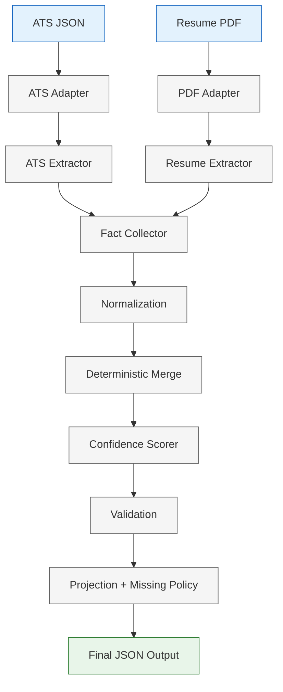

# Multi-Source Candidate Data Transformer

Deterministic Node.js/TypeScript pipeline that ingests candidate data from multiple sources, normalizes and merges it into a canonical profile, computes confidence, and projects runtime-configured JSON output.

## Project Overview

This project processes one candidate per run from two inputs:
- ATS JSON (structured)
- Resume PDF (unstructured text extraction)

Pipeline guarantees deterministic behavior through stable ordering, fixed precedence/weights, explicit validation, and pure transformation modules.

## Architecture Diagram



## Supported Sources

- `ats_json`: parsed and validated structured candidate payload.
- `resume_pdf`: plain text extracted via `pdf-parse`, then rule/regex-based extraction.

Not supported: LinkedIn/GitHub inputs, NLP/LLM inference, multi-candidate batch in a single run.

## Normalization

Normalization runs on extracted `CandidateFact` values before merge:
- Phones -> E.164 (`libphonenumber-js`), invalid values become `null`.
- Employment dates -> `YYYY-MM` (`date-fns` parsing helpers), ambiguous/invalid values become `null`.
- Country -> ISO-3166 alpha-2 (case-insensitive mapping).
- Skills -> canonical names (e.g., `JS` -> `JavaScript`, `TS` -> `TypeScript`, `Node` -> `Node.js`, `Postgres` -> `PostgreSQL`).

## Merge Strategy

Deterministic merge policy:
- Group facts by canonical field path.
- Scalar conflicts resolved by:
  1. source precedence (`ats_json` > `resume_pdf`)
  2. fact confidence
  3. extraction quality
  4. lexical tie-break
- Collection fields use union + dedup with stable order.
- Provenance from all contributing facts is preserved.
- Missing/unknown values remain `null`; no inferred values are invented.

## Confidence Strategy

Fixed weighted scorer (no ML):
- Field confidence combines source reliability, extraction quality, and agreement factor.
- Agreement adjusts score for single-source, multi-source agreement, or conflict patterns.
- Scores are clamped to `[0,1]`.
- Overall confidence is a deterministic weighted aggregation of important fields.

## Projection Configuration

Runtime projection config controls output shape:
- field subset selection
- path remapping (`from`)
- type expectations
- normalization directives (`E164`, `YYYY-MM`, `ISO-3166-alpha-2`, `canonical`)
- required fields
- include confidence/provenance
- missing policy: `null` | `omit` | `error`

Config is runtime-validated with Zod before execution.

## CLI Usage

Command:

```bash
candidate-transformer transform --ats <file> --resume <file> --config <file> [--output <file>]
```

Behavior:
- Missing required args -> help/error and non-zero exit.
- On success without `--output`: prints projected JSON to stdout.
- With `--output`: writes JSON file and prints concise diagnostics to stderr.
- Fatal validation/pipeline errors return non-zero exit.

## Installation

```bash
pnpm install
```

## Build

```bash
pnpm build
```

Build output entrypoint: `dist/src/main.js`

## Run

Development (watch mode):

```bash
pnpm dev transform --ats tests/fixtures/ats/sample.json --resume tests/fixtures/resume/sample.pdf --config tests/fixtures/config/default-config.json
```

Built output via npm script (`start`):

```bash
pnpm start transform \
  --ats tests/fixtures/ats/sample.json \
  --resume tests/fixtures/resume/sample.pdf \
  --config tests/fixtures/config/default-config.json
```

Built output direct Node invocation (equivalent):

```bash
node dist/src/main.js transform \
  --ats tests/fixtures/ats/sample.json \
  --resume tests/fixtures/resume/sample.pdf \
  --config tests/fixtures/config/default-config.json
```

## Test

```bash
pnpm test
pnpm typecheck
```

## Sample Commands

Default projection:

```bash
pnpm start transform \
  --ats tests/fixtures/ats/sample.json \
  --resume tests/fixtures/resume/sample.pdf \
  --config tests/fixtures/config/default-config.json
```

Custom projection:

```bash
pnpm start transform \
  --ats tests/fixtures/ats/sample.json \
  --resume tests/fixtures/resume/sample.pdf \
  --config tests/fixtures/config/custom-config.json \
  --output tests/fixtures/expected/custom-output.json
```

## Assumptions

- One execution transforms one candidate aggregated from provided sources.
- Input files are local and accessible at runtime.
- Resume extraction is deterministic and pattern-based; uncertain matches are skipped.
- Confidence uses fixed, explainable rules and weights.

## Limitations

- Resume extraction is intentionally heuristic-light (regex/rule based), not semantic NLP.
- Source support is currently limited to ATS JSON + Resume PDF.
- No online enrichment, no external profile crawling, no ML model scoring.
- No built-in batch orchestration for multiple candidates.

## Project Structure

```text
src/
  adapters/       source readers (ATS JSON, Resume PDF)
  extraction/     source-to-fact extraction + fact collection
  normalization/  canonical value normalization utilities
  merge/          deterministic merge policy + dedup helpers
  confidence/     fixed weighted confidence scoring
  projection/     runtime-configured profile projection
  validation/     Zod schemas + validation entrypoints
  app/            pipeline orchestration context/runner
  cli/            Commander commands/options
  types/          domain models and error contracts
  config/         runtime defaults and reliability constants
  shared/         IO/result/sorting utilities
tests/
  integration/    end-to-end pipeline tests
  unit/           focused module tests
  fixtures/       ATS/resume/config/expected samples
```

## Design Decisions

- **Determinism first**: stable sort order, explicit tie-breaks, fixed weights.
- **Separation of concerns**: adapters/extraction/normalization/merge/confidence/projection isolated as composable modules.
- **Runtime safety**: strict Zod validation for config, canonical profile, and projected output.
- **Explainability**: provenance and confidence metadata retained across the pipeline.
- **Immutable flow**: transformations produce new values and avoid mutating inputs.

## Submission Contents

- **Design PDF**
  - Step 1 technical design PDF: [Anshu-Sinha_anshujuly2@gmail.com_Eightfold.pdf](./Anshu-Sinha_anshujuly2@gmail.com_Eightfold.pdf)
- **Source Code**
  - Full implementation in `src/`
- **Tests**
  - Vitest suite in `tests/`
- **Fixtures**
  - Input and expected output fixtures in `tests/fixtures/`
- **README**
  - This document with setup and run instructions
- **Demo Video**
  - Short end-to-end demo: https://drive.google.com/file/d/1WXmdLHtwNPxSb7cguDJ1LJPyPG7ybjkI/view?usp=sharing
